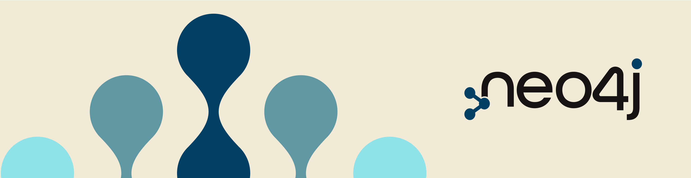

# 👋 Hi, I'm Morgan Senechal

## 🚀 About Me

I'm a **Principal Consultant** at [Neo4j](https://neo4j.com/), specializing in **Graph Technologies**. With a rich background in **Data Management, Big Data Analytics, and Security**, I've worked across various sectors like telecom, finance, and fraud detection, contributing significantly to product development and innovation.

### 📈 My Expertise
- **Database Technologies**: Specializing in Neo4j, I bring complex data relationships to life, aiding in decision-making and insights but also have a strong background in SQL and NoSQL Databases.
- **Cloud Deployments & Kubernetes**: Experienced in deploying scalable, secure, and efficient cloud solutions.
- **Security**: Proficient in implementing robust security measures, including SSO and LDAP integrations.
- **Big Data Analytics**: Turning vast data into actionable insights.
- **Product Development**: Innovating and improving technology solutions.

### 🌍 Industries I've Impacted
- 📡 **Telecom**
- 💰 **Finance**
- 🔍 **Fraud Detection**

## 🌟 Highlights of My Journey
- 🛠️ Developed integration, features and functionalities to extend product capabilities to answer the customer needs.
- 💡 Regularly contribute to [Neo4j Developer Blog](https://medium.com/neo4j).
- 🚀 Offer professional consulting, deployment, training, and troubleshooting expertise.

## 📚 Continuous Learning
I'm always on the lookout for new technologies and methodologies to enhance my skills and keep up with the ever-evolving IT landscape.

## 🤝 Connect With Me
- 📧 Email: [morgan.senechal@neo4j.com](mailto:morgan.senechal@neo4j.com)
- 💼 LinkedIn: [Morgan Senechal](https://www.linkedin.com/in/morgan-senechal/)
- 📕 Medium: [@morgan-senechal](https://medium.com/@morgan-senechal)

## 📖 My Latest Articles
- [One login to rule them all: Integrate Neo4j with Azure SSO](Link_to_your_article)
- [Needle StarterKit: The Ultimate Tool for Accelerating Your Graph App Projects](Link_to_your_article)

---

> *“In the world of data, graph technology is the future. And I am excited to be a part of this evolving story!”* - **Morgan Senechal**

